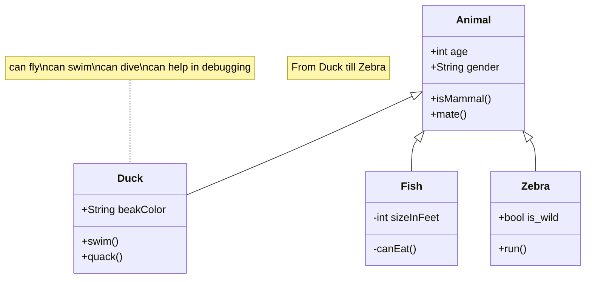

# Content & Component Polish Implementation Plan

> **For agentic workers:** REQUIRED SUB-SKILL: Use superpowers:subagent-driven-development (recommended) or superpowers:executing-plans to implement this plan task-by-task. Steps use checkbox (`- [ ]`) syntax for tracking.

**Goal:** Translate all 5 zh/ blog posts to English, refactor Header/Footer to accept a `lang` prop (fixing mobile menu links), and create `/zh/message` and `/zh/friends` pages.

**Architecture:** Three independent tasks (A, B, C) that can be executed in any order. Task A adds new content files and adds `translationKey` to existing zh/ files. Task B threads the `lang` prop through layouts into Header/Footer, removing URL-detection coupling. Task C creates two new zh/ pages.

**Tech Stack:** Astro 5, Bun, TypeScript, Tailwind CSS. No new dependencies. Verification: `bun run build` must produce 0 errors.

---

## Task A: Translate zh/ Articles to English

**Files:**
- Create: `src/content/blog/en/fix-node-sass-install-error.md`
- Create: `src/content/blog/en/github-pages-deploy-astro.md`
- Create: `src/content/blog/en/new-features-test.md`
- Create: `src/content/blog/en/use-dayjs-instead-date.md`
- Create: `src/content/blog/en/vue-2.7-jsx-bugs.md`
- Modify: `src/content/blog/zh/fix-node-sass-install-error.md`
- Modify: `src/content/blog/zh/github-pages-deploy-astro.md`
- Modify: `src/content/blog/zh/new-features-test.md`
- Modify: `src/content/blog/zh/use-dayjs-instead-date.md`
- Modify: `src/content/blog/zh/vue-2.7-jsx-bugs.md`

- [ ] **Step 1: Add translationKey to all 5 zh/ files**

Add `translationKey: <slug>` to each zh/ file's frontmatter (below `category`):

`src/content/blog/zh/fix-node-sass-install-error.md` — add:
```yaml
translationKey: fix-node-sass-install-error
```

`src/content/blog/zh/github-pages-deploy-astro.md` — add:
```yaml
translationKey: github-pages-deploy-astro
```

`src/content/blog/zh/new-features-test.md` — add:
```yaml
translationKey: new-features-test
```

`src/content/blog/zh/use-dayjs-instead-date.md` — add:
```yaml
translationKey: use-dayjs-instead-date
```

`src/content/blog/zh/vue-2.7-jsx-bugs.md` — add:
```yaml
translationKey: vue-2.7-jsx-bugs
```

- [ ] **Step 2: Create `en/fix-node-sass-install-error.md`**

Create `src/content/blog/en/fix-node-sass-install-error.md` with the full content below:

```markdown
---
draft: false
date: 2025-02-27
title: Fixing node-sass Installation Errors
description: Encountered node-sass installation errors again in 2025 — here's how to fix them quickly.
mermaid: true
mathjax: true
tags: ['css', 'sass', 'node-sass']
category: ['frontend']
translationKey: fix-node-sass-install-error
---

## Common Installation Errors

### 1. Node.js and node-sass version mismatch

According to the node-sass readme, you need to match the node-sass version to your Node.js runtime:

```
NodeJS  | Supported node-sass version | Node Module
--------|-----------------------------|------------
Node 20 | 9.0+                        | 115
Node 19 | 8.0+                        | 111
Node 18 | 8.0+                        | 108
Node 17 | 7.0+, <8.0                  | 102
Node 16 | 6.0+                        | 93
Node 15 | 5.0+, <7.0                  | 88
Node 14 | 4.14+, <9.0                 | 83
Node 13 | 4.13+, <5.0                 | 79
Node 12 | 4.12+, <8.0                 | 72
Node 11 | 4.10+, <5.0                 | 67
Node 10 | 4.9+, <6.0                  | 64
Node 8  | 4.5.3+, <5.0                | 57
Node <8 | <5.0                        | <57
```

### 2. Download failure due to network issues

:::note
By default, node-sass downloads its binary directly from GitHub. Due to the GFW, this download will almost certainly be interrupted, causing installation to fail.
:::

node-sass supports overriding the download mirror. You can configure it as follows:
1. CLI: `npm install node-sass --sass-binary-site=http://example.com/`
2. `.npmrc`: `sass_binary_site=http://example.com/`

:::tip
A working mirror for users in China: `https://npmmirror.com/mirrors`
:::

### 3. Switch to dart sass

Replace the npm package `node-sass` with `sass`.

## References

1. mirror-config-china: https://www.npmjs.com/package/mirror-config-china
```

- [ ] **Step 3: Create `en/github-pages-deploy-astro.md`**

Create `src/content/blog/en/github-pages-deploy-astro.md`:

```markdown
---
draft: false
date: 2024-10-22
title: Quick Deploy Astro to GitHub Pages
description: How to build a blog quickly and for free with Astro & GitHub Pages.
mermaid: true
mathjax: true
tags: ['astro']
category: ['frontend']
translationKey: github-pages-deploy-astro
---

> ^_^ This site itself was built using the method described below — feel free to click around and see Astro in action.

## Deployment Steps

1. Generate an Astro project. You can choose from an existing theme at [Astro Themes Gallery](https://astro.build/themes).
2. Create a GitHub Pages repository.
    - Example: `github.com/your-user-name/your-user-name.github.io`
    - The main branch (`main`) stores the deployed static files.
3. Create a `source` branch for the source code. Push code to the `source` branch.
4. Build with Astro:
    - If you have a custom domain, configure a **CNAME** in your Astro project pointing to it.
    - See the [Astro configuration reference](https://docs.astro.build/en/reference/configuration-reference/).
5. Use the [gh-pages](https://github.com/tschaub/gh-pages) library to publish the build output to the `main` branch.
6. Visit the site via your CNAME domain to verify.

## Known Issues

1. GitHub Pages does not serve files or folders whose names start with an underscore.

    By default, Astro builds generate `/_astro/` and `/_astro/_xxx.js` files. Because of Jekyll's default behavior on GitHub Pages, these paths are not accessible directly.

    Fix: Place a `.nojekyll` file in the root of the GitHub Pages repo to [disable Jekyll](https://docs.github.com/en/pages/getting-started-with-github-pages/about-github-pages#static-site-generators).
```

- [ ] **Step 4: Create `en/new-features-test.md`**

Create `src/content/blog/en/new-features-test.md`:

```markdown
---
draft: false
date: 2024-10-02
title: New Features Test
description: More new features specific to this theme.
mermaid: true
mathjax: true
tags: []
category: []
translationKey: new-features-test
---

### Support collapse

```bash
:::collapse
Hello World!
:::
```


:::collapse
Hello World!
:::

### Support admonitions

```markdown
:::tip[Customized Title]
hello world
:::

:::note
note
:::

:::caution
caution
:::

:::danger
danger
:::

```

:::tip[Customized Title]
hello world
:::

:::note
note

```js
console.log('hello world')
```

:::

:::caution
caution
:::

:::danger
danger
:::


### Support mermaid

Use:

+ start with **```mermaid**
+ end with **```**
+ set markdown frontmatter `mermaid: true`.

Mermaid Code:

```html title="mermaid.md"
classDiagram
    note "From Duck till Zebra"
    Animal <|-- Duck
    note for Duck "can fly\ncan swim\ncan dive\ncan help in debugging"
    Animal <|-- Fish
    Animal <|-- Zebra
    Animal : +int age
    Animal : +String gender
    Animal: +isMammal()
    Animal: +mate()
    class Duck{
        +String beakColor
        +swim()
        +quack()
    }
    class Fish{
        -int sizeInFeet
        -canEat()
    }
    class Zebra{
        +bool is_wild
        +run()
    }
```

Result:



### Support mathjax

+ set markdown frontmatter `mathjax: true`.

#### Block Mode

```yaml title="Mathjax.md"
---
mathjax: true
---
hello!
$$ \sum_{i=0}^N\int_{a}^{b}g(t,i)\text{d}t $$
hello!
```

hello! 
$$ \sum_{i=0}^N\int_{a}^{b}g(t,i)\text{d}t $$
hello!

#### Inline Mode

```yaml title="Mathjax.md"
---
mathjax: true
---
hello! $ \sum_{i=0}^N\int_{a}^{b}g(t,i)\text{d}t $ hello!
```

hello! $ \sum_{i=0}^N\int_{a}^{b}g(t,i)\text{d}t $ hello!

### Integration with Expressive Code

For more usage, please refer to the official website [expressive-code](https://expressive-code.com/).

```js title="line-markers.js" del={2} ins={3-4} {6}
function demo() {
  console.log('this line is marked as deleted')
  // This line and the next one are marked as inserted
  console.log('this is the second inserted line')

  return 'this line uses the neutral default marker type'
}
```

### Code folding is supported by default

```js
var myArr = [1,2]
console.log(myArr)

var myObj = {a: 1, b: 2}

for(let key of myArr){
  console.log(key)
}

var it = myArr[Symbol.iterator]()
it.next() // {value: 1, done: false}

// VM704:12 Uncaught TypeError: myObj is not iterable
for(let key of myObj){
  console.log(key)
}

```
```

- [ ] **Step 5: Create `en/use-dayjs-instead-date.md`**

Create `src/content/blog/en/use-dayjs-instead-date.md`:

```markdown
---
draft: false
date: 2024-11-02
title: Using Day.js for Date Operations
description: How to work with dates conveniently using Day.js.
mermaid: true
mathjax: true
tags: []
category: ['frontend']
translationKey: use-dayjs-instead-date
---

## Two Code Snippets Compared

### 1. Raw time manipulation

```js
setTimeout(() => {
  // logic
}, 60 * 60 * 1000)
```

### 2. Using Day.js

```js
const oneHour = dayjs.duration(1, 'hours').asMilliseconds()

setTimeout(() => {
    // logic
}, oneHour)
```

Which snippet is easier to read?

The second one is clearly more semantic — you can tell at a glance how long the timer runs.

:::tip
[Semantic programming](https://worktile.com/kb/ask/2229667.html) means writing code with a clear, expressive style and naming conventions so that the code is easier to read, understand, maintain, and reuse.

Key benefits:
1. Readability
2. Maintainability
3. Reusability
4. Implicit conventions
5. Compatibility
:::

## About Day.js

Day.js is a package with a core of only 2 KB, designed as a replacement for the heavyweight Moment.js. It provides a similar API, making migration from Moment.js straightforward.

Day.js also has a [plugin](https://day.js.org/docs/en/plugin/plugin) system, so larger, less commonly used features can be loaded on demand.

Day.js method names clearly express intent, parameters follow natural mental models, and chaining is supported — all of which reduce errors. It is recommended as a drop-in replacement for hand-rolled date manipulation code.

### Common Use Cases

#### Parsing a string to a date

The string must conform to [ISO 8601](https://en.wikipedia.org/wiki/ISO_8601).

```js
dayjs('2018-04-04T16:00:00.000Z')
dayjs('2018-04-13 19:18:17.040+02:00')
dayjs('2018-04-13 19:18')
```

#### Converting between JS Date and Day.js

```js
var d = new Date(2018, 8, 18)
var day = dayjs(d)

var date = day.toDate()
```

#### Reading and writing date fields

```js
dayjs().valueOf() // current timestamp

dayjs().second(30) // set seconds to 30
dayjs().second() // read seconds
```

#### Formatting dates

```js
dayjs().format('YYYY-MM-DD HH:mm:ss')
```

#### Calculating differences

```js
const date1 = dayjs('2019-01-25')
const date2 = dayjs('2018-06-05')
date1.diff(date2) // milliseconds: 20217600000

// Difference in a specific unit (truncated)
date1.diff('2018-06-05', 'month') // 7
// With decimal
date1.diff('2018-06-05', 'month', true) // 7.645161290322581
```

#### Comparing dates

`isAfter`:

```js
dayjs().isAfter(dayjs('2024-11-03')) // true
// Compare from month granularity (month + year only)
dayjs().isAfter(dayjs('2024-11-03'), 'month') // false
```

`isBefore` and `isSame` work the same way.

`isSameOrAfter` / `isSameOrBefore` — include boundary; requires the [`IsSameOrBefore`](https://day.js.org/docs/en/query/is-same-or-before) plugin.

`isBetween` — checks if a date falls between two others; requires the [`IsBetween`](https://day.js.org/docs/en/plugin/is-between) plugin. Also supports a granularity unit.

```js
dayjs.extend(isBetween)
dayjs('2010-10-20').isBetween('2010-10-19', dayjs('2010-10-25'))  // true

dayjs('2010-10-20').isBetween('2010-10-19', '2010-10-25', 'month') // false
```

#### Adding and subtracting time

```js
var a = dayjs('2024-11-03')
a.add(2, 'day')      // => 2024-11-05
a.subtract(1, 'day') // => 2024-11-02
```

#### Duration objects

:::note
Requires the [`Duration`](https://day.js.org/docs/en/plugin/duration) plugin.
:::

```js
dayjs.extend(duration)

dayjs.duration({ months: 12 })
dayjs.duration(12, 'm'); // equivalent to the object form above
```

Durations support arithmetic:

```js
var a = dayjs.duration(1, 'd');
var b = dayjs.duration(2, 'd');

a.add(b).days(); // 3
a.add({ days: 2 }).days();
a.subtract(2, 'days');
```

A Day.js date object can be added a duration:

```js
var a = dayjs('2024-11-03')
var b = dayjs.duration(2, 'd')

a.add(b).date(); // 5
```
```

- [ ] **Step 6: Create `en/vue-2.7-jsx-bugs.md`**

Create `src/content/blog/en/vue-2.7-jsx-bugs.md`:

```markdown
---
draft: false
date: 2024-10-21
title: Buggy Vue 2.7 JSX
description: Vue 2.7 JSX just keeps throwing bugs...
mermaid: true
mathjax: true
tags: ['vue']
category: ['frontend']
translationKey: vue-2.7-jsx-bugs
---

While maintaining a legacy project I recently introduced Vue 2.7 and the official JSX plugin `jsx-vue2`. Things were going fine until I started hitting one pitfall after another...

## 1. vModel throws an error with the official Vue 2 JSX plugin

> vModel: __currentInstance.$set is not a function

Related issues:

- https://github.com/vuejs/jsx-vue2/issues/287
- https://github.com/vuejs/composition-api/issues/699

Workaround:

Drop the `vModel` shorthand and fall back to `value` + `onInput` manually.

## 2. Cannot get a component ref

Related issue:

- https://github.com/vuejs/jsx-vue2/issues/288

Workaround:

Assign the ref manually using a function:

```jsx
const customRef = ref()

<SwitchSettingCommonModal ref={el => { customRef.value = el }} />
```

----
Looking forward to the next pitfall 🥹.

----
Since Vue 2 has reached EOL and is no longer maintained officially, I would not recommend continuing to use Vue 2 or its JSX plugin. If you still have active development needs, migrate to Vue 3 — it is still maintained and bugs will be fixed.
```

- [ ] **Step 7: Verify build succeeds**

Run:
```bash
bun run build
```

Expected: `[build] N page(s) built` with **no errors**. The en/ blog posts should now appear in the build output under `/blog/`:
```
▶ src/pages/blog/[...slug].astro
  ├─ /blog/fix-node-sass-install-error/index.html
  ├─ /blog/github-pages-deploy-astro/index.html
  ├─ /blog/new-features-test/index.html
  ├─ /blog/use-dayjs-instead-date/index.html
  └─ /blog/vue-2.7-jsx-bugs/index.html
```

- [ ] **Step 8: Commit Task A**

```bash
git add src/content/blog/
git commit -m "feat: add English translations for all 5 blog posts"
```

---

## Task B: lang Prop Refactor (Header, Footer, Layouts)

**Files:**
- Modify: `src/components/Header.astro`
- Modify: `src/components/Footer.astro`
- Modify: `src/layouts/IndexPage.astro`
- Modify: `src/layouts/BlogPost.astro`

- [ ] **Step 1: Update Header.astro to accept lang prop**

Replace the frontmatter block of `src/components/Header.astro` (lines 1–18):

```astro
---
import {getCollectionByName} from "../utils/getCollectionByName";
import getUniqueTags from "../utils/getUniqueTags";
import getCountByCategory from "../utils/getCountByCategory";
import HeaderLink from './HeaderLink.astro';
import ThemeIcon from './ThemeIcon.astro'
import LangIcon from './LangIcon.astro'
import MenuIcon from './MenuIcon.astro'
import {site, categories, infoLinks} from '../consts';
import AsideIcon from "./SidebarIcon.astro";
import { useTranslations, getLangFromUrl, type Lang } from '../i18n/utils'

interface Props { lang?: Lang }
const { lang: langProp } = Astro.props
const lang: Lang = langProp ?? getLangFromUrl(Astro.url)
const t = useTranslations(lang)
const prefix = lang === 'zh' ? '/zh' : ''

import getCountByTagName from "../utils/getCountByTagName";
const blogs = await getCollectionByName('blog')
let tagArr = getUniqueTags(blogs);
let categoryCount = getCountByCategory(blogs);
let tagCount = getCountByTagName(blogs);
---
```

- [ ] **Step 2: Fix Header mobile menu links**

In `src/components/Header.astro`, the site logo `<a>` tag (line 26) currently hardcodes `href="/"`. Change it to:

```astro
<a class="text-2xl p-4" href={lang === 'zh' ? '/zh' : '/'}>{site.title}</a>
```

In the `#personal-info` panel, the category links (around line 96) currently link to `/category/` + category. Change to use prefix:

```astro
<a class="hover:text-skin-active" title={category + " (" + categoryCount[category] + ")"} href={prefix + "/category/" + category}>
  {category + " (" + categoryCount[category] + ")"}
</a>
```

The tag links (around line 116) currently link to `/tags/` + tag. Change to:

```astro
<a class="hover:text-skin-active my-2" title={tag} href={prefix + "/tags/" + tag}>{tag + " (" + tagCount[tag] + ")"}</a>
```

- [ ] **Step 3: Update Footer.astro to accept lang prop**

Replace the entire frontmatter of `src/components/Footer.astro` (lines 1–5):

```astro
---
import {site, config} from "../consts";
import { useTranslations, getLangFromUrl, type Lang } from '../i18n/utils'

interface Props { lang?: Lang }
const { lang: langProp } = Astro.props
const lang: Lang = langProp ?? getLangFromUrl(Astro.url)
const t = useTranslations(lang)
---
```

- [ ] **Step 4: Forward lang from IndexPage.astro to Header and Footer**

In `src/layouts/IndexPage.astro`, change:
```astro
<Header/>
```
to:
```astro
<Header lang={lang}/>
```

And change:
```astro
<Footer/>
```
to:
```astro
<Footer lang={lang}/>
```

- [ ] **Step 5: Forward lang from BlogPost.astro to Header and Footer**

In `src/layouts/BlogPost.astro`, change:
```astro
<Header/>
```
to:
```astro
<Header lang={lang}/>
```

And change:
```astro
<Footer/>
```
to:
```astro
<Footer lang={lang}/>
```

- [ ] **Step 6: Verify build succeeds**

Run:
```bash
bun run build
```

Expected: 0 errors, same page count as before this task.

- [ ] **Step 7: Commit Task B**

```bash
git add src/components/Header.astro src/components/Footer.astro src/layouts/IndexPage.astro src/layouts/BlogPost.astro
git commit -m "refactor: pass lang prop to Header and Footer, fix mobile menu links"
```

---

## Task C: Create /zh/message and /zh/friends Pages

**Files:**
- Create: `src/pages/zh/message/index.astro`
- Create: `src/pages/zh/friends/index.astro`

- [ ] **Step 1: Create /zh/message/index.astro**

Create `src/pages/zh/message/index.astro`:

```astro
---
import IndexPage from "../../../layouts/IndexPage.astro";
import {comment} from "../../../consts";
import { useTranslations } from '../../../i18n/utils'

const t = useTranslations('zh')
---

<IndexPage frontmatter={{comment: comment.enable, donate: false}} lang="zh">
  <div class="flex text-xl underline-offset-4 font-bold">
    {t('message.welcome')}
  </div>
  <div>
    {t('message.welcomeTips')}
  </div>
</IndexPage>
```

- [ ] **Step 2: Create /zh/friends/index.astro**

Create `src/pages/zh/friends/index.astro`:

```astro
---
import IndexPage from "../../../layouts/IndexPage.astro";
import Friends from "../../../components/Friends.astro";
import {friendshipLinks} from "../../../consts";
---

<IndexPage frontmatter={{ comment: true }} lang="zh">
  <div class="grid grid-cols-1 lg:grid-cols-2 gap-4 w-full">
    {friendshipLinks ? friendshipLinks.map((friend) => <Friends {...friend} />) : ""}
  </div>
</IndexPage>
```

- [ ] **Step 3: Verify build succeeds and new pages appear**

Run:
```bash
bun run build
```

Expected output should include:
```
▶ src/pages/zh/message/index.astro
  └─ /zh/message/index.html
▶ src/pages/zh/friends/index.astro
  └─ /zh/friends/index.html
```

- [ ] **Step 4: Commit Task C**

```bash
git add src/pages/zh/message/ src/pages/zh/friends/
git commit -m "feat: add /zh/message and /zh/friends pages"
```

---

## Final Verification

- [ ] **Run full build one last time**

```bash
bun run build
```

Expected: 0 errors. Page count should have grown from 42 to ~52 (5 new en/ blog posts × 1 route each = 5, plus /zh/message and /zh/friends = 2, total +7).
