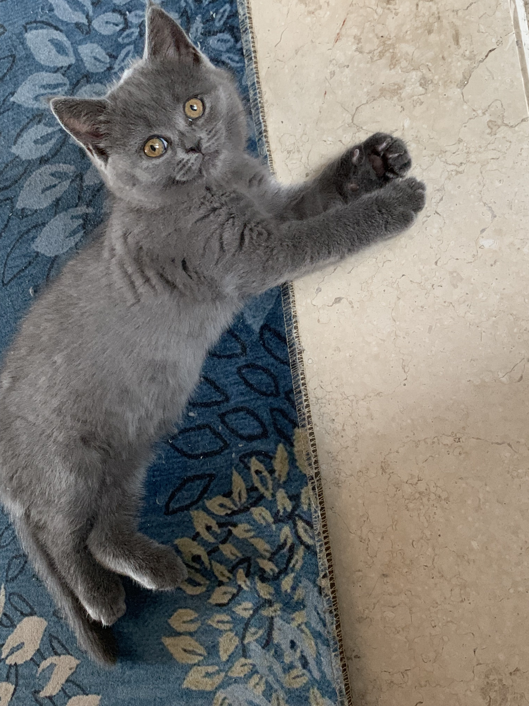
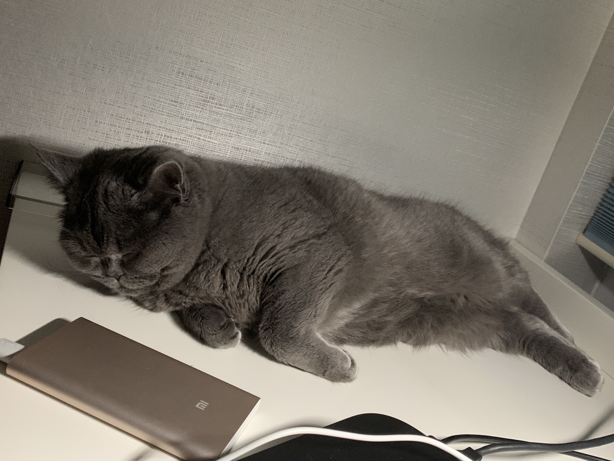

2020/2/3，节后工作第一天。在家休息了好久终于可以工作了😁。

## 过去的一月

2020开年就是各种事，首先武汉出现了影响较大的疫情，全国范围都受波及，希望可以尽快结束，缩减各方面的影响。

另外，NBA球星[科比布莱恩特](https://zh.wikipedia.org/wiki/%E7%A7%91%E6%AF%94%C2%B7%E5%B8%83%E8%8E%B1%E6%81%A9%E7%89%B9)直升机出事，着实令我们这群一直都喜欢着他的球迷心痛。但是居然出现了利用他的离世炒作的商人，这是何等的市井小人。

## 现在

虽然一月有很多不开心，但是生活还在继续，小小的困难都不算什么。

因为我有了她，一只已经8个月的铁憨憨英短:p(从刚接回家的1斤到现在的7斤)。

小猫虽然调皮，但也带来了很多的欢乐，也是繁忙工作生活之余的一种自我释放吧。

## 未来

2020的2月才刚刚开始，前途无限。

多思考，多行动，多运动。

Living happy, living healthy。🆙

2020, go!
