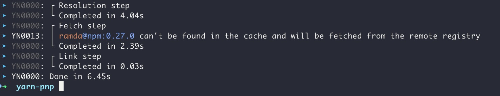
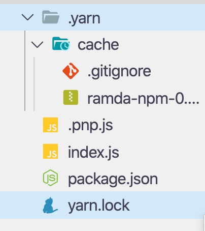
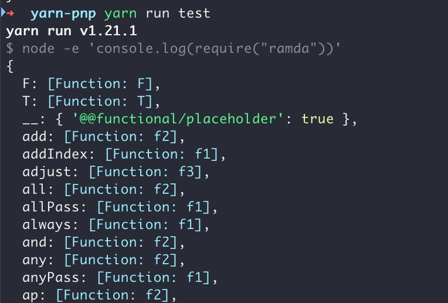
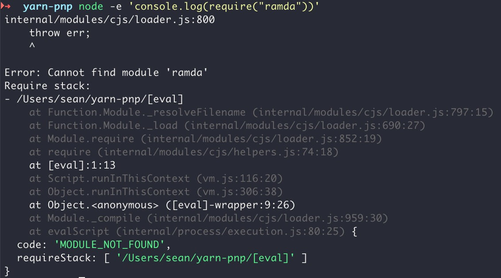
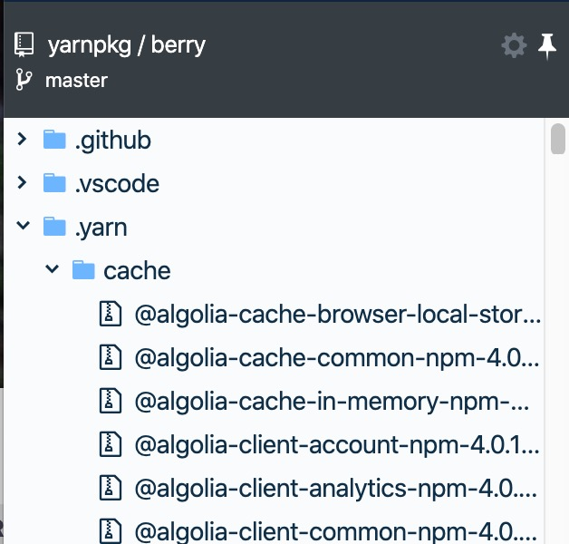

2020年1月下旬，Node包管理工具Yarn推出了2.0版本。1.12版本开始加入的PnP功能默认包含。

## 历史

随着前端领域的飞速发展，前端的库越来越多。为了更好地管理各种各样的库，Nodejs推出了官方的包管理工具npm。

在npm5之前，npm cli使用体检不佳:

1. 没有依赖锁定使得不同环境安装可能会出现版本冲突；
2. 没有本地离线缓存功能，无网环境下会安装失败；
3. 依赖安装比较慢。

> npm5起加入了版本锁定等功能，提高了依赖安装速度。

因为npm存在的这些问题，Yarn横空出世，给npm依赖的安装管理带来了便利的交互和更快的速度等。

## Yarn 2

因为`(感谢)`yarn的存在，npm改进了自身cli的体验，加入了版本锁定等提升安装速度的特性。现在日常使用中npm、yarn两者安装的速度已经相差无几。

但是，node项目始终存在问题——依赖目录`node_modules`过重。占用过大、文件过多，安装过程中IO开销过大。

> 1. 一个同事的Windows电脑，磁盘速度不快。出现问题时删除项目的`node_modules`花费了10分钟(基本每次都是喝杯茶回来才好)。
> 2. `node_modules`目录太复杂，且文件又多又小，比较吃磁盘。

来自yarn官方对于node包解析低效的原因说明:

> - `node_modules`目录通常包含了大量的文件，`yarn install`时可能会花超过70%的时间生成它们。由于包管理工具依然会将已存在的`node_modules`和期待结果进行diff，所以即便之前已经执行过install操作也无法挽救。
>
> - 因为`node_modules`的生成是IO密集操作，包管理工具除了做简单的文件拷贝(甚至在可能时，可以使用硬链接或者`copy-on-write`技术)之外没有其他办法更好的优化方法，仍需在操作磁盘的大量系统调用前diff文件差异。
>
> - 因为Node没有包的概念，它也不知道文件是否`应该`被访问(`与其相对的是被标记表示需要使用`)。完全可能出现这样的场景，因为忘记在`package.json`中列举了部分依赖导致开发环境可用的代码在生产环境出现问题。
>
> - 甚至在运行时，Node的解析机制需要大量的`stat`和`readdir`系统调用去计算每个被require的文件的路径位置。这是极其浪费的，也是Node应用启动耗时长的部分原因。
>
> - 最后，`node_modules`目录不支持包管理工具合理扁平处理包文件结构，这一设计是不切实际的。即使有些算法可以拿来优化依赖树的结构，但依旧不能优化一些特定的场景——不仅导致了文件磁盘占用比预期高，也使得一些包在内存中被实例化多次。
>
> *Ps* `versus being available by the sheer virtue of hoisting` => 不理解，就翻译成了`与其相对的是被标记表示需要使用`


例1:
以`create-react-app`为例，一行代码未写，已经占用了`188MB`。


例2:


为了解决`node_modules`目录存在的问题，Yarn正式推出了Yarn 2，加入了pnp(`Plug'n'Play`)功能。

### PnP

PnP，`Plug'n'Play`的缩写，意为即插即用。

启用PnP后(Yarn 2默认启用)，`yarn install`不再生成`node_modules`目录，而是生成了`.yarn`目录和`.pnp.js`文件。

`.yarn`目录存放了项目中下载的所有依赖的zip包，`.pnp.js`的内容是项目的npm模块解析规则。

#### 使用🌰

下面以本地安装并console.log`ramda`为例。

1. 新建项目，加入依赖`ramda`

```json
{
  "dependencies": {
    "ramda": "^0.27.0"
  }
}
```

2. yarn install





3. yarn run test

> 在package.json中定义"test"
>
> "test" => "node -e 'console.log(require(\"ramda\"))'"



> 不能直接使用`node xxx.js`，因为node依赖解析的目录`node_modules`没了。



#### 其他说明

1. PnP的依赖变成了zip包，可以上传VCS。开发、编译环境的依赖包可以做到完全一致，也可以省去安装的时间。

    [yarn官方仓库](https://github.com/yarnpkg/berry)就使用了这种方式管理依赖。

    
1. 因为PnP、Yarn才刚推出不久，不推荐项目直接升级。
1. 前端社区其他工具链支持度还不够，从官方看已有下列的工具有条件支持(某版本起或插件支持)。
  > 来自[yarn官方站说明](https://yarnpkg.com/features/pnp#caveats-and-work-in-progress)。
  >
  > Babel
  >
  > Create-React-App
  >
  > ESLint
  >
  > Husky
  >
  > Jest
  >
  > Prettier
  >
  > Rollup
  >
  > TypeScript-ESLint
  >
  > WebStorm
  >
  > TypeScript
  >
  > VSCode-ESLint
  >
  > VSCode
  >
  > Webpack
  >

## 总结

yarn pnp的出现给前端工程角度带来了新的方向，值得尝试和探索。

对个人开发者来说可能影响不大，但是团队、公司层面的项目需要慎重，可以尝鲜，不建议直接切换。

另外，前端又有新玩具玩了😁。

## 参考

1. [yarn pnp介绍](https://yarnpkg.com/features/pnp)
